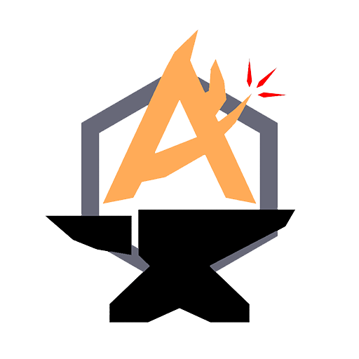

<p align="center">
  
</p>

<h1 align="center">GameKO</h1>

<p align="center">
  Unity · GameMaker · RPG Maker 게임의 영어/일본어 문장을 자동으로 찾아 한국어로 번역하고 적용하는 Windows 도구
</p>

<p align="center"><strong>제작: AINFORGE</strong></p>

<p align="center">
  <a href="https://github.com/ensacom2019/GameKorean/releases/latest"><strong>Windows 최신 버전 다운로드</strong></a>
</p>

## 사용 방법

처음 사용한다면 아래 순서만 따라 하면 됩니다. Python이나 API 키는 필요하지 않습니다.

1. [최신 릴리스](https://github.com/ensacom2019/GameKorean/releases/latest)에서 `GameKO-Windows.zip`을 받습니다.
2. ZIP의 압축을 완전히 풉니다. 압축 파일 안에서 바로 실행하면 안 됩니다.
3. 번역할 게임을 종료합니다. Steam에서도 실행 중이 아닌지 확인합니다.
4. 압축을 푼 폴더의 `GameKO.exe`를 실행합니다.
5. `게임 폴더 선택`을 눌러 **게임 실행 파일이 들어 있는 폴더**를 선택합니다.
6. 처음에는 번역 방식을 `웹 자동 번역 (키 없음)`, 원문 언어를 `자동`으로 두면 됩니다.
7. `자동 번역 시작`을 누르고 완료 팝업이 뜰 때까지 기다립니다.
8. 완료 후 게임을 실행해 번역과 한글 폰트를 확인합니다.

게임 폴더나 게임 실행 파일을 `GameKO.exe` 위로 끌어놓아도 자동으로 경로를 찾습니다.

### Unity 게임은 어떤 옵션을 선택하나요?

| 원하는 방식 | 설정 | 특징 |
|---|---|---|
| 가장 간단하게 사용 | `Unity 정적 패치(테스트)`를 끔 | XUnity를 설치하고 게임 실행 중 나타나는 문장을 번역합니다. 처음에는 이 방식을 권장합니다. |
| 게임 리소스를 직접 번역 | `Unity 정적 패치(테스트)`를 켬 | 저장된 대본과 StringTable을 찾아 게임 파일에 직접 적용합니다. 동적으로 생성되는 문장은 제외됩니다. |
| 다른 Unity 버전에 TMP 폰트 시도 | `버전 무시하고 TMP 강제 적용`을 켬 | 폰트 호환 문제가 있을 때만 사용합니다. 평소에는 꺼두는 편이 안전합니다. |

XUnity 방식은 설치가 끝난 뒤 게임을 실행해야 화면 문장 수집과 번역이 시작됩니다. 정적 패치 방식은 완료 팝업이 뜬 시점에 게임 파일 적용까지 끝난 상태입니다.

### 번역 전 상태로 되돌리기

1. 게임을 완전히 종료합니다.
2. 번역할 때 사용한 게임 폴더를 다시 선택합니다.
3. `원본 복원`을 누르고 확인합니다.
4. `원본 복원 완료` 팝업에서 복원한 파일 수를 확인합니다.

GameKO는 게임 파일을 바꾸기 전에 `gameko_project/backup`에 최초 원본을 저장합니다. 이 폴더를 삭제하면 GameKO로 복원할 수 없으므로 번역을 유지하는 동안 보관하세요. 이미 원본 상태이거나 활성 백업 기록이 없으면 성공으로 표시하지 않고 이유를 안내합니다.

### 문제가 생겼을 때

- 한글이 네모로 보이면 먼저 `버전 무시하고 TMP 강제 적용` 없이 다시 시도합니다. Unity 버전에 따라 TMP 폰트 구조가 다를 수 있습니다.
- 웹 번역이 느려지면 403/429 요청 제한일 수 있습니다. GameKO가 자동으로 속도를 낮추며, 중단 후 다시 실행해도 저장된 번역부터 이어집니다.
- 오류 팝업에 원인이 표시되며 전체 기록은 게임 폴더의 `gameko_project/error_logs`에 저장됩니다.
- 백업이 없는 상태에서 게임 파일 복구가 필요하면 Steam의 `설치된 파일 무결성 확인` 등 게임 배포처의 복구 기능을 사용하세요.

## 주요 기능

- **게임 엔진 자동 감지**: 게임 폴더를 선택하면 Unity Mono/IL2CPP, GameMaker, RPG Maker MV/MZ 중 어떤 엔진인지 자동으로 판별합니다.
- **추출부터 적용까지 자동 처리**: 문장 추출, 원문 언어 선택, 기계번역, 한국어 패치, 결과 검증을 한 번에 진행합니다.
- **영어·일본어 선택 번역**: 일본어와 영어가 함께 있을 때 원작 언어를 추정하며, 사용자가 `일본어만` 또는 `영어만`으로 직접 지정할 수도 있습니다.
- **API 키 없는 웹 번역**: 별도 계정이나 API 키 없이 웹 번역을 사용할 수 있습니다. 로컬 Argos Translate와 OpenAI 호환 서버도 선택할 수 있습니다.
- **한글 폰트 자동 적용**: Noto Sans CJK KR을 사용해 엔진에 맞는 방식으로 한글 폰트를 설치하거나 글리프를 보완합니다.
- **번역 메모리와 이어하기**: 번역한 문장은 로컬에 저장해 재요청하지 않으며, 중단 후 다시 실행하면 저장된 지점부터 이어집니다.
- **속도 자동 조절**: 여러 문장을 동시에 번역하고, 웹 서비스가 403/429로 제한하면 자동 감속한 뒤 안정화되면 다시 속도를 높입니다.
- **진행 시간 표시**: 진행률, 경과 시간, 예상 남은 시간을 GUI에서 실시간으로 표시합니다.
- **CSV 직접 편집**: 추출한 대사를 CSV로 내보내 직접 다듬은 다음 다시 가져와 적용할 수 있습니다.
- **제어 코드 보호**: TMP Rich Text 태그, RPG Maker 제어 문자, 치환 변수와 포맷 문자열을 보호한 상태로 번역합니다.
- **원본 백업과 복원**: 변경 전 최초 원본을 자동 백업하며, GUI의 `원본 복원`으로 GameKO가 변경한 파일을 되돌릴 수 있습니다.
- **명확한 완료 알림**: 자동 번역과 원본 복원이 끝나면 처리 결과와 파일 수를 모달 팝업으로 알려줍니다.
- **상세 오류 보고서**: 실패 단계와 원인을 화면에 표시하고 `gameko_project/error_logs`에 진단 로그를 저장합니다.

## 지원 엔진

| 엔진 | 자동 감지 기준 | 번역 적용 방식 |
|---|---|---|
| Unity Mono | `게임명_Data` | 기본 XUnity.AutoTranslator 설치 또는 Unity 정적 패치 |
| Unity IL2CPP | `게임명_Data` + `GameAssembly.dll` | BepInEx 기반 XUnity 또는 Unity 정적 패치 |
| GameMaker | `data.win`, `game.win`, `game.unx` 등 | 문자열 추출 후 `data.win` 계열 리소스 재패킹 |
| RPG Maker MV/MZ | `www/data/System.json` 또는 `data/System.json` | JSON 이벤트·데이터를 항목 단위로 번역 후 적용 |

선택한 폴더 바로 아래에 게임 폴더가 하나만 있으면 자동으로 찾아갑니다. 게임 후보가 여러 개면 잘못된 파일을 수정하지 않도록 작업을 중단하고 직접 선택하도록 안내합니다.

## Unity 번역 방식

Unity는 게임 구조에 따라 두 가지 방식을 제공합니다.

### XUnity 실시간 번역

기본 방식입니다. 게임에 맞춰 ReiPatcher 또는 BepInEx와 XUnity.AutoTranslator를 설치하고, 실행 중 화면에 나타나는 문장을 수집·번역합니다.

- 정적으로 저장되지 않은 동적 문장도 처리 가능
- 선택한 원문 언어를 XUnity 설정에 자동 반영
- Noto Sans CJK KR 일반 폰트와 TMP fallback 적용
- GameKO가 설치한 파일은 `원본 복원` 대상에 포함

### Unity 정적 패치(테스트)

GUI에서 `Unity 정적 패치(테스트)`를 선택하면 XUnity를 설치하지 않고 게임 리소스를 직접 분석합니다.

- AssetBundle과 리소스의 `TextAsset` 추출
- Unity Localization `StringTable` 추출 및 번역
- `StreamingAssets`의 JSON·CSV·TSV와 대본형 텍스트 처리
- Addressables StringTable 수정 시 카탈로그 CRC 처리 및 `catalog.hash` 갱신
- 번역문을 리소스에 재패킹한 뒤 다시 읽어 검증
- 정적으로 찾지 못한 동적 문장은 건드리지 않음

암호화된 파일, 커스텀 바이너리, 구조가 불명확한 일반 `MonoBehaviour`는 안전을 위해 자동 수정하지 않습니다. 검사 결과는 `gameko_project/unity_static_scan.json`에 기록됩니다.

## 한글 폰트 처리

GameKO에는 SIL Open Font License 1.1의 `NotoSansCJKkr-Regular.otf`와 해당 폰트로 만든 Unity TMP AssetBundle이 포함됩니다.

| 엔진 | 폰트 적용 방식 |
|---|---|
| Unity XUnity | Windows 폰트 등록, 일반 fallback 및 호환되는 TMP fallback 연결 |
| Unity 정적 패치 | 확인 가능한 기존 TMP FontAsset의 글리프·아틀라스 교체 시도 |
| GameMaker | 번역문에 필요한 한글 글리프만 기존 비트맵 폰트 아틀라스 뒤에 추가 |
| RPG Maker MV | 게임 폰트 파일과 CSS 연결 교체 |
| RPG Maker MZ | 폰트 파일 설치 후 `System.json`의 기본 글꼴 교체 |

`버전 무시하고 TMP 강제 적용`을 선택하면 다른 Unity 버전에도 제공된 TMP 폰트를 적용해 봅니다. Unity/TMP 직렬화 구조가 다르면 표시 오류나 실행 실패가 발생할 수 있으므로 실험 기능으로 취급하며, 실패 이유는 `unity_static_font_report.json`에 기록합니다.

## 번역 기능

### 원문 언어 선택

- `자동(원작 감지·일본어 우선)`: 언어 메타데이터와 문장 분포를 확인하고, 판단하기 어려우면 일본어를 우선합니다.
- `일본어만`: 일본어로 판단된 문자열만 번역합니다.
- `영어만`: 영어로 판단된 문자열만 번역합니다.

선택하지 않은 언어는 번역 요청과 패치에서 모두 제외됩니다.

### 번역기

- `웹 자동 번역 (키 없음)`: Google 계열 웹 번역과 MyMemory를 순차적으로 사용합니다.
- `Argos Translate`: 선택 설치 방식의 오프라인 번역입니다.
- `OpenAI 호환 서버`: Ollama 같은 로컬 서버나 호환 API를 사용할 수 있습니다.

웹 번역은 비공식 엔드포인트를 사용하므로 인터넷 연결이 필요하며 서비스 정책이나 요청 제한에 따라 일시적으로 느려지거나 동작하지 않을 수 있습니다. 번역 결과는 `gameko_project/translation_memory.json`에 저장됩니다.

### 문장 형식 보호

번역 전 다음과 같은 요소를 임시 토큰으로 보호하고 결과에 원래 형태로 복원합니다.

- TextMeshPro 태그: `<color>`, `<size>`, `<sprite>` 등
- RPG Maker 제어 문자: `\\N[1]`, `\\V[2]`, `\\C[3]` 등
- 변수와 서식: `{name}`, `%s`, `%1`, `${value}` 등
- HTML/XML 형태의 태그와 이스케이프 시퀀스

## 대사 직접 편집

1. `대사 추출·내보내기...`로 CSV를 저장합니다.
2. Excel 등의 프로그램에서 `target` 열만 수정합니다.
3. `수정한 대사 가져와 적용...`으로 CSV를 다시 불러옵니다.

가져올 때 필수 열, 중복 ID, 다른 게임의 원문이 섞였는지 검사합니다. `id`와 `source` 열은 변경하지 않는 것을 권장합니다.

## 작업 파일과 복원

GameKO는 선택한 게임 폴더에 `gameko_project` 작업 폴더를 만듭니다.

| 경로 | 내용 |
|---|---|
| `translations.csv` | 추출한 원문과 번역문 |
| `translation_memory.json` | 재사용할 번역 캐시 |
| `backup/` | 최초 원본 백업 |
| `error_logs/` | 오류 발생 시 상세 진단 로그 |
| `unity_static_scan.json` | Unity 정적 추출 결과 |
| `unity_static_font_report.json` | Unity TMP 폰트 처리 결과 |
| `gamemaker_font_report.json` | GameMaker 폰트 처리 결과 |

`원본 복원`은 GameKO가 변경하거나 추가한 파일만 대상으로 합니다. GameKO는 원본 백업과 복원 상태를 먼저 기록한 뒤 게임 파일을 교체하며, 복원 전에는 필요한 백업이 모두 있는지 확인하고 복사 결과도 검증합니다. 백업이 없으면 성공으로 표시하지 않고 복원을 중단합니다. 번역 적용 전 게임을 종료해야 파일 잠금과 데이터 손상을 피할 수 있습니다.

## 소스 실행과 빌드

요구 사항: Windows, Python 3.10 이상

```powershell
python -m pip install -e .
./scripts/run_gui.bat
```

오프라인 Argos Translate까지 설치하려면 다음 명령을 사용합니다.

```powershell
python -m pip install -e ".[offline]"
```

Windows 배포본 빌드:

```powershell
python -m pip install -e ".[build]"
./scripts/build_windows.ps1
```

완성된 프로그램은 `dist/GameKO/GameKO.exe`에 생성됩니다. 빌드 스크립트는 EXE의 import와 GUI 초기화, Unity 정적 패치 기본 흐름을 자동 점검합니다.

## 현재 한계

- 이미지에 그려진 글자와 음성은 번역하지 않습니다.
- Unity IL2CPP 후킹은 게임과 Unity 버전에 따라 일부 문장을 놓칠 수 있습니다.
- Unity 정적 패치는 구조가 확인된 TextAsset, StringTable, 느슨한 대본 파일만 수정합니다.
- GameMaker YYC, 커스텀 압축, 특수 폰트 또는 RPG Maker 플러그인의 독자 데이터는 자동 처리되지 않을 수 있습니다.
- 게임에 포함된 폰트·UI 구조에 따라 한글이 네모로 표시되거나 문장이 UI 영역을 벗어날 수 있습니다.
- 모든 게임의 자동 번역을 보장하지 않습니다. DRM 해제, 암호화 우회 기능은 포함하지 않습니다.

본인이 소유하거나 수정 허가를 받은 게임에만 사용하세요.

## 오픈소스 및 라이선스

GameKO는 MIT License로 배포됩니다. 엔진 처리에는 다음 프로젝트의 공개 구현과 문서를 참고하거나 사용합니다.

- [XUnity.AutoTranslator](https://github.com/bbepis/XUnity.AutoTranslator)
- [UnityPy](https://github.com/K0lb3/UnityPy)
- [UndertaleModTool](https://github.com/UnderminersTeam/UndertaleModTool)
- [Argos Translate](https://github.com/argosopentech/argos-translate)

포함된 구성 요소의 상세 라이선스는 [docs/THIRD_PARTY.md](docs/THIRD_PARTY.md)를 확인하세요.
